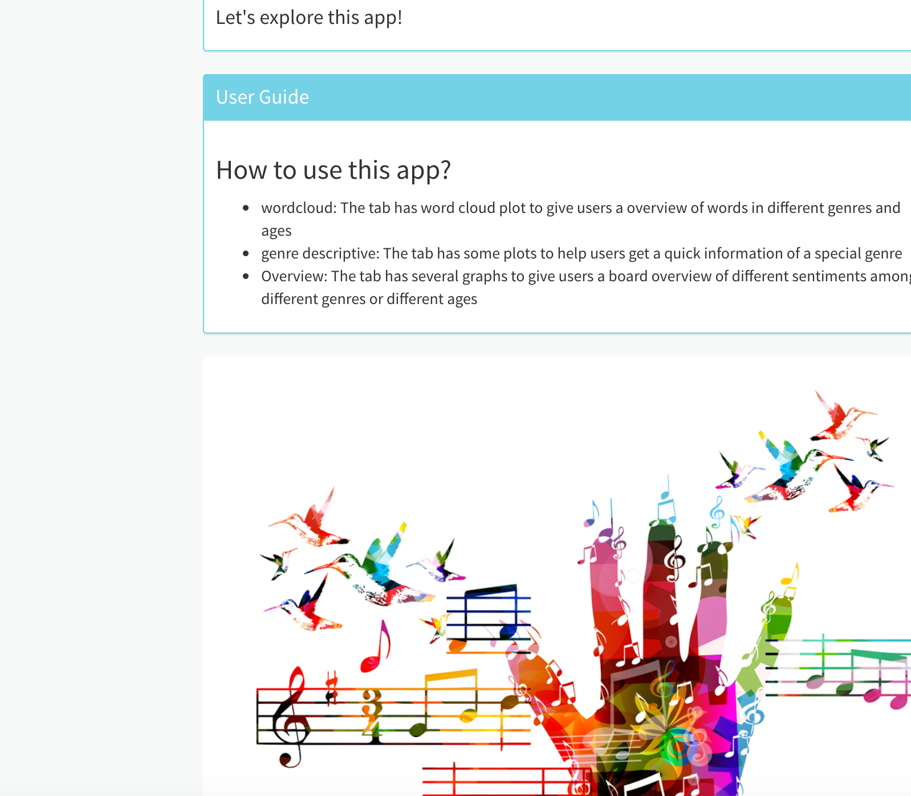
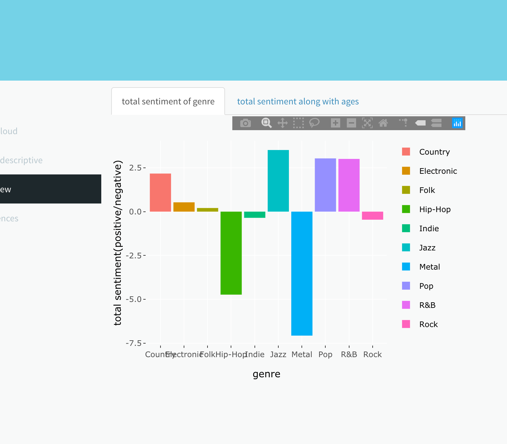

# Applied Data Science @ Columbia
## Spring 2020
## Project 1: A "data story" on the songs of our times


### [Project Description](doc/)
This is the first and only *individual* (as opposed to *team*) this semester. 

Term: Spring 2020

+ Projec title: Lorem ipsum dolor sit amet
+ This project is conducted by Yuyao(Olivia) Wang, who is a Columbia master student in MA statistics program, taking a tiny step here by designing this application.

+ Project summary: 

• Used text processing to deal with raw data, which is a filtered corpus of 100,000+(380,000 totally)song lyrics from MetroLyrics, which available features are song name, year, artist, genre, and lyrics
• Used text mining, topic modeling, and sentiment analysis to analyze music's lyrics by R
• Analyzed and visualized the differences and connections among songs of different genres, variety of sentiment and expressions of emotions from the 1950s to the present, as well as changes towards emotions on the track of time of a song.
• The final report can work as a mini Wikipedia of different genre music
• Made a shinyapp which aims to help users to discover and compare different genres and their sentiments in a more efficient manner, and is created by Olivia Wang in February 2020. https://yuyao-olivia-wang.shinyapps.io/lyrics/






Following [suggestions](http://nicercode.github.io/blog/2013-04-05-projects/) by [RICH FITZJOHN](http://nicercode.github.io/about/#Team) (@richfitz). This folder is orgarnized as follows.

```
proj/
├── lib/
├── data/
├── doc/
├── figs/
└── output/
```

Please see each subfolder for a README file.
